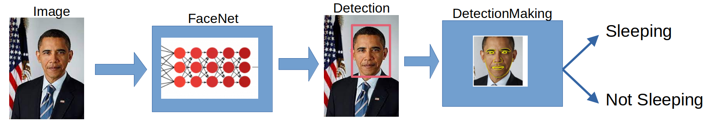

# Driver Drowsiness Detection with PyTorch
Simplified schema of a system:    

## Driver drowsiness detection with Convolutional Neural Network(CNN)    
Vision-based driver drowsiness detection utilizes cameras installed within vehicles to monitor the driver's facial expressions and eye movements in real-time. By analyzing factors such as eyelid closure, head position, and blink frequency, the system can accurately determine levels of drowsiness or fatigue. Advanced algorithms process the visual data to detect signs of driver fatigue and issue warnings to alert the driver, potentially preventing accidents caused by drowsy driving. This technology is crucial for enhancing road safety by providing timely intervention when the driver's alertness level decreases. Integrating vision-based driver drowsiness detection systems into vehicles can significantly reduce the risk of accidents and save lives on the road.    

